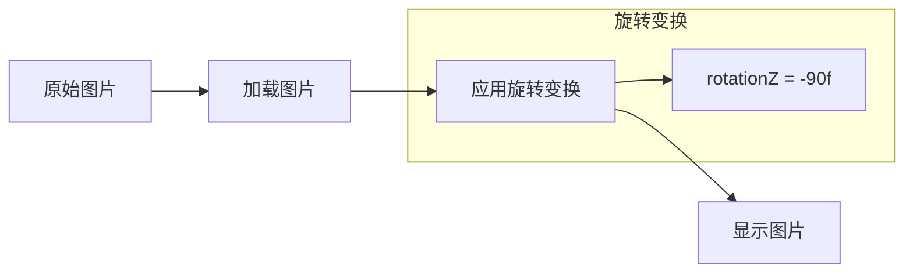

# Design Document

## Overview

本设计文档描述手机端App调试模式的重新设计方案。主要目标是：
1. 优化调试模式的入口位置和用户体验
2. 统一调试日志和演示模式的访问方式
3. 修复图片显示方向问题
4. 确保用餐详情页面正确显示照片

## Architecture

### 组件架构

```
ProfileScreen
├── UserHeaderCard
├── NutritionProgressCard
├── NutritionGoalsCard
├── WeightTrackingCard
├── HealthProfileCard
├── SettingsSection
│   ├── DebugLogItem (移除)
│   └── AboutItem
└── DebugModeSection (新增)
    ├── DebugLogOption
    └── DemoModeOption
```

### 图片处理流程



## Components and Interfaces

### 1. DebugModeSection 组件

新增的调试模式区域组件，放置在ProfileScreen底部。

```kotlin
@Composable
fun DebugModeSection(
    isExpanded: Boolean,
    onToggleExpand: () -> Unit,
    onDebugLogClick: () -> Unit,
    onDemoModeClick: () -> Unit,
    modifier: Modifier = Modifier
)
```

### 2. 图片旋转工具函数

统一的图片旋转处理，应用于所有图片显示场景。

```kotlin
// 在 Modifier 中应用旋转
Modifier.graphicsLayer {
    rotationZ = -90f  // 逆时针旋转90度
}
```

### 3. ProfileScreen 更新

修改ProfileScreen以包含新的DebugModeSection：

```kotlin
@Composable
fun ProfileScreen(
    // ... 现有参数
    onNavigateToDebugLog: () -> Unit,
    onNavigateToDemoMode: () -> Unit,
    modifier: Modifier = Modifier
)
```

### 4. Navigation 更新

更新导航以支持从ProfileScreen访问DemoMode：

```kotlin
// 在 ProfileScreen composable 中添加
onNavigateToDemoMode = { navController.navigate(Screen.Demo.route) }
```

## Data Models

### Demo JSON 数据结构

眼镜端的JSON响应数据结构：

```kotlin
data class DemoMealResponse(
    val snapshotId: String,
    val sessionId: String,
    val rawLlm: RawLlmData,
    val snapshot: SnapshotData,
    val suggestion: String
)

data class RawLlmData(
    val isFood: Boolean,
    val foods: List<FoodItem>,
    val suggestion: String
)

data class FoodItem(
    val dishName: String,
    val dishNameCn: String?,
    val cookingMethod: String,
    val ingredients: List<Ingredient>,
    val totalWeightG: Double,
    val confidence: Double,
    val category: String
)

data class SnapshotData(
    val foods: List<Any>,
    val nutrition: NutritionData,
    val imageUrl: String?
)

data class NutritionData(
    val calories: Double,
    val protein: Double,
    val carbs: Double,
    val fat: Double
)
```


## Correctness Properties

*A property is a characteristic or behavior that should hold true across all valid executions of a system-essentially, a formal statement about what the system should do. Properties serve as the bridge between human-readable specifications and machine-verifiable correctness guarantees.*

Based on the prework analysis, the following correctness property has been identified:

### Property 1: Demo JSON Parsing Round Trip

*For any* valid demo meal response JSON, parsing the JSON into data objects and then serializing back to JSON should produce semantically equivalent data (same snapshot_id, session_id, foods count, and nutrition values).

**Validates: Requirements 2.2**

**Rationale:** JSON parsing is a critical component that can have subtle bugs. Round-trip testing ensures the parser correctly handles all fields in the demo data format.

---

**Note:** Most acceptance criteria in this feature are UI-related (rendering, navigation, user interactions) which are better suited for example-based UI tests rather than property-based tests. The image rotation (Requirements 3.x) is a static transformation that doesn't vary with input, making it an example test case rather than a property.

## Error Handling

### 1. JSON Parsing Errors

- **Scenario**: Demo JSON file is malformed or missing required fields
- **Handling**: Log error, show user-friendly error message, disable affected demo mode option
- **Recovery**: Allow retry, provide fallback to default demo data if available

### 2. Image Loading Errors

- **Scenario**: Photo file not found or corrupted
- **Handling**: Display placeholder image, log error for debugging
- **Recovery**: Show "Photo unavailable" message, allow user to continue viewing other data

### 3. Navigation Errors

- **Scenario**: Target screen not found in navigation graph
- **Handling**: Log error, show toast message
- **Recovery**: Stay on current screen, prevent app crash

## Testing Strategy

### Unit Testing

Unit tests will cover:
1. DebugModeSection component rendering states (expanded/collapsed)
2. Navigation callback invocations
3. JSON parsing of demo data files
4. Image rotation modifier application

### Property-Based Testing

Property-based testing library: **Kotest** with property testing module

Configuration:
- Minimum 100 iterations per property test
- Use Arb generators for JSON data variations

Property tests will cover:
- **Property 1**: Demo JSON parsing round trip consistency

Each property-based test will be tagged with:
```kotlin
// **Feature: debug-mode-redesign, Property 1: Demo JSON Parsing Round Trip**
```

### Integration Testing

Integration tests will verify:
1. End-to-end navigation from ProfileScreen to DebugLogScreen
2. End-to-end navigation from ProfileScreen to DemoScreen
3. Photo display with rotation in FoodDetailScreen

### UI Testing

Compose UI tests will verify:
1. DebugModeSection visibility and interaction
2. Photo rotation visual correctness
3. Meal detail screen layout with photo
