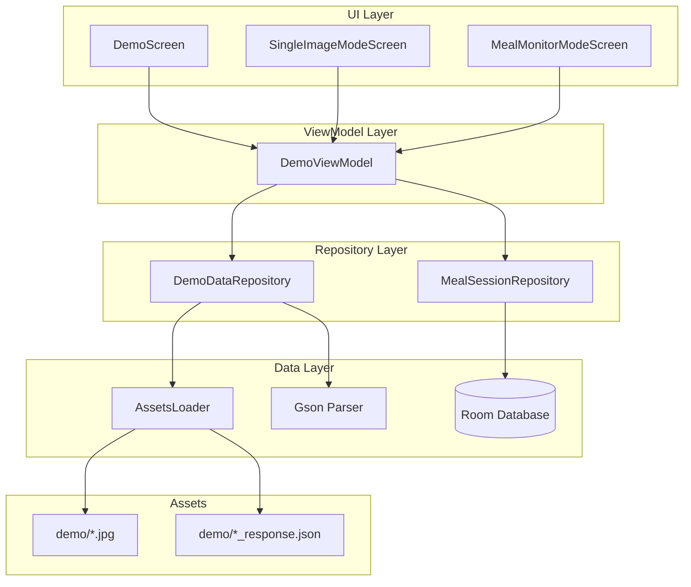

# Design Document: Demo Simulation Mode

## Overview

演示模拟模式为手机App提供离线模拟食物识别功能，用于演示和测试。系统复用现有的数据模型（VisionAnalyzeResponse）和存储层（MealSessionRepository），通过加载预设的JSON数据模拟眼镜端的识别流程。

核心设计原则：
1. **数据一致性**：使用与眼镜端完全相同的API响应格式
2. **代码复用**：复用现有的Repository和数据模型
3. **可配置性**：支持通过替换JSON文件更新模拟数据
4. **用户体验**：提供直观的UI和流畅的模拟流程

## Architecture



## Components and Interfaces

### 1. DemoDataRepository

负责加载和解析模拟数据。

```kotlin
class DemoDataRepository(private val context: Context) {
    
    /**
     * 加载单图识别的模拟数据
     * @param foodType 食物类型: "coke" | "chips"
     * @return VisionAnalyzeResponse 或 null
     */
    suspend fun loadSingleImageData(foodType: String): VisionAnalyzeResponse?
    
    /**
     * 加载用餐监测阶段的模拟数据
     * @param phase 阶段: "start" | "middle" | "end"
     * @return VisionAnalyzeResponse 或 null
     */
    suspend fun loadMealPhaseData(phase: String): VisionAnalyzeResponse?
    
    /**
     * 加载图片资源
     * @param imageName 图片文件名
     * @return Bitmap 或 null
     */
    fun loadDemoImage(imageName: String): Bitmap?
    
    /**
     * 检查模拟数据是否可用
     */
    fun isDemoDataAvailable(): DemoDataStatus
}

data class DemoDataStatus(
    val cokeAvailable: Boolean,
    val chipsAvailable: Boolean,
    val mealStartAvailable: Boolean,
    val mealMiddleAvailable: Boolean,
    val mealEndAvailable: Boolean
)
```

### 2. DemoViewModel

管理演示模式的UI状态和业务逻辑。

```kotlin
class DemoViewModel(
    private val demoDataRepository: DemoDataRepository,
    private val mealSessionRepository: MealSessionRepository
) : ViewModel() {
    
    // UI 状态
    val uiState: StateFlow<DemoUiState>
    
    // 单图识别
    fun selectFood(foodType: String)
    fun startSingleImageRecognition()
    
    // 用餐监测
    fun startMealMonitoring()
    fun triggerMiddleCapture()
    fun endMealMonitoring()
    
    // 保存结果
    private suspend fun saveRecognitionResult(response: VisionAnalyzeResponse)
}

data class DemoUiState(
    val currentMode: DemoMode = DemoMode.SELECTION,
    val selectedFood: String? = null,
    val previewImage: Bitmap? = null,
    val isProcessing: Boolean = false,
    val processingMessage: String = "",
    val recognitionResult: VisionAnalyzeResponse? = null,
    val mealPhase: MealPhase = MealPhase.NOT_STARTED,
    val mealProgress: MealProgress? = null,
    val error: String? = null
)

enum class DemoMode {
    SELECTION,      // 模式选择
    SINGLE_IMAGE,   // 单图识别
    MEAL_MONITOR    // 用餐监测
}

enum class MealPhase {
    NOT_STARTED,
    STARTING,       // 开始用餐中
    IN_PROGRESS,    // 用餐中
    ENDING,         // 结束用餐中
    COMPLETED       // 已完成
}

data class MealProgress(
    val baselineCalories: Double,
    val currentCalories: Double,
    val consumedCalories: Double,
    val consumptionRatio: Double,
    val startTime: Long,
    val snapshots: List<SnapshotInfo>
)
```

### 3. UI Components

#### DemoScreen (模式选择)
```kotlin
@Composable
fun DemoScreen(
    onSelectSingleImage: () -> Unit,
    onSelectMealMonitor: () -> Unit,
    onBack: () -> Unit
)
```

#### SingleImageModeScreen
```kotlin
@Composable
fun SingleImageModeScreen(
    uiState: DemoUiState,
    onSelectFood: (String) -> Unit,
    onStartRecognition: () -> Unit,
    onViewResult: () -> Unit,
    onBack: () -> Unit
)
```

#### MealMonitorModeScreen
```kotlin
@Composable
fun MealMonitorModeScreen(
    uiState: DemoUiState,
    onStartMeal: () -> Unit,
    onTriggerCapture: () -> Unit,
    onEndMeal: () -> Unit,
    onViewResult: () -> Unit,
    onBack: () -> Unit
)
```

## Data Models

### 模拟数据JSON格式

使用与眼镜端API响应完全一致的格式：

```json
{
  "raw_llm": {
    "is_food": true,
    "foods": [
      {
        "dish_name": "Coca-Cola",
        "dish_name_cn": "可口可乐",
        "cooking_method": "none",
        "ingredients": [
          {"name_en": "carbonated water", "weight_g": 330, "confidence": 0.95}
        ],
        "total_weight_g": 330,
        "confidence": 0.92,
        "category": "beverage"
      }
    ],
    "suggestion": "建议适量饮用，注意糖分摄入"
  },
  "snapshot": {
    "foods": [],
    "nutrition": {
      "calories": 140,
      "protein": 0,
      "carbs": 39,
      "fat": 0
    },
    "image_url": "https://viseat.cn/uploads/demo/coke.jpg"
  },
  "suggestion": "建议适量饮用，注意糖分摄入"
}
```

### Assets 目录结构

```
assets/demo/
├── coke.jpg                    # 可乐图片
├── coke_response.json          # 可乐模拟数据
├── chips.jpg                   # 薯片图片
├── chips_response.json         # 薯片模拟数据
├── meal_start.jpg              # 用餐开始图片
├── meal_start_response.json    # 用餐开始数据
├── meal_middle.jpg             # 用餐中图片
├── meal_middle_response.json   # 用餐中数据
├── meal_end.jpg                # 用餐结束图片
├── meal_end_response.json      # 用餐结束数据
└── README.md                   # 说明文档
```

## Error Handling

| 错误场景 | 处理方式 |
|---------|---------|
| JSON文件不存在 | 使用内置默认数据，显示提示 |
| JSON解析失败 | 显示错误信息，禁用对应选项 |
| 图片加载失败 | 显示占位图，允许继续操作 |
| 数据库保存失败 | 显示错误提示，允许重试 |


## Correctness Properties

*A property is a characteristic or behavior that should hold true across all valid executions of a system-essentially, a formal statement about what the system should do. Properties serve as the bridge between human-readable specifications and machine-verifiable correctness guarantees.*

Based on the prework analysis, the following correctness properties have been identified:

### Property 1: JSON Parsing Round Trip

*For any* valid VisionAnalyzeResponse object, serializing it to JSON and then deserializing back should produce an equivalent object with the same nutrition values (calories, protein, carbs, fat).

**Validates: Requirements 3.2**

### Property 2: Food Selection State Consistency

*For any* valid food type selection (coke, chips), the UI state should correctly reflect the selected food and load the corresponding preview image.

**Validates: Requirements 2.2, 2.3**

### Property 3: Nutrition Data Extraction

*For any* valid Raw_Response JSON containing raw_llm and snapshot fields, the parser should correctly extract all nutrition values (calories, protein, carbs, fat) and food information (name, category).

**Validates: Requirements 3.3, 3.4, 3.5**

### Property 4: Data Persistence Round Trip

*For any* recognition result saved to the database, querying the database should return the same nutrition data that was saved.

**Validates: Requirements 2.6, 10.1, 10.2**

### Property 5: Meal Progress Calculation

*For any* meal monitoring session with baseline calories B and current remaining calories C, the consumed calories should equal (B - C) and the consumption ratio should equal (B - C) / B.

**Validates: Requirements 7.3, 8.2, 9.4**

### Property 6: Meal Phase State Machine

*For any* meal monitoring session, the phase transitions should follow the valid sequence: NOT_STARTED → STARTING → IN_PROGRESS → ENDING → COMPLETED, and no invalid transitions should be allowed.

**Validates: Requirements 6.4, 7.4, 8.5**

## Testing Strategy

### Property-Based Testing

使用 **Kotest** 作为属性测试框架（Kotlin 生态系统中最成熟的 PBT 库）。

配置要求：
- 每个属性测试运行至少 100 次迭代
- 使用 Arb（Arbitrary）生成器创建随机测试数据

```kotlin
// build.gradle.kts
testImplementation("io.kotest:kotest-runner-junit5:5.8.0")
testImplementation("io.kotest:kotest-property:5.8.0")
```

### Unit Tests

单元测试覆盖以下场景：
- DemoDataRepository 的 JSON 加载和解析
- DemoViewModel 的状态管理
- 边界条件（空数据、无效JSON、缺失字段）

### Integration Tests

集成测试验证：
- Assets 文件加载
- 数据库保存和读取
- UI 导航流程

### Test File Structure

```
src/test/kotlin/com/rokid/nutrition/phone/
├── demo/
│   ├── DemoDataRepositoryTest.kt      # 单元测试
│   ├── DemoViewModelTest.kt           # 单元测试
│   └── DemoPropertyTest.kt            # 属性测试
└── ...
```
