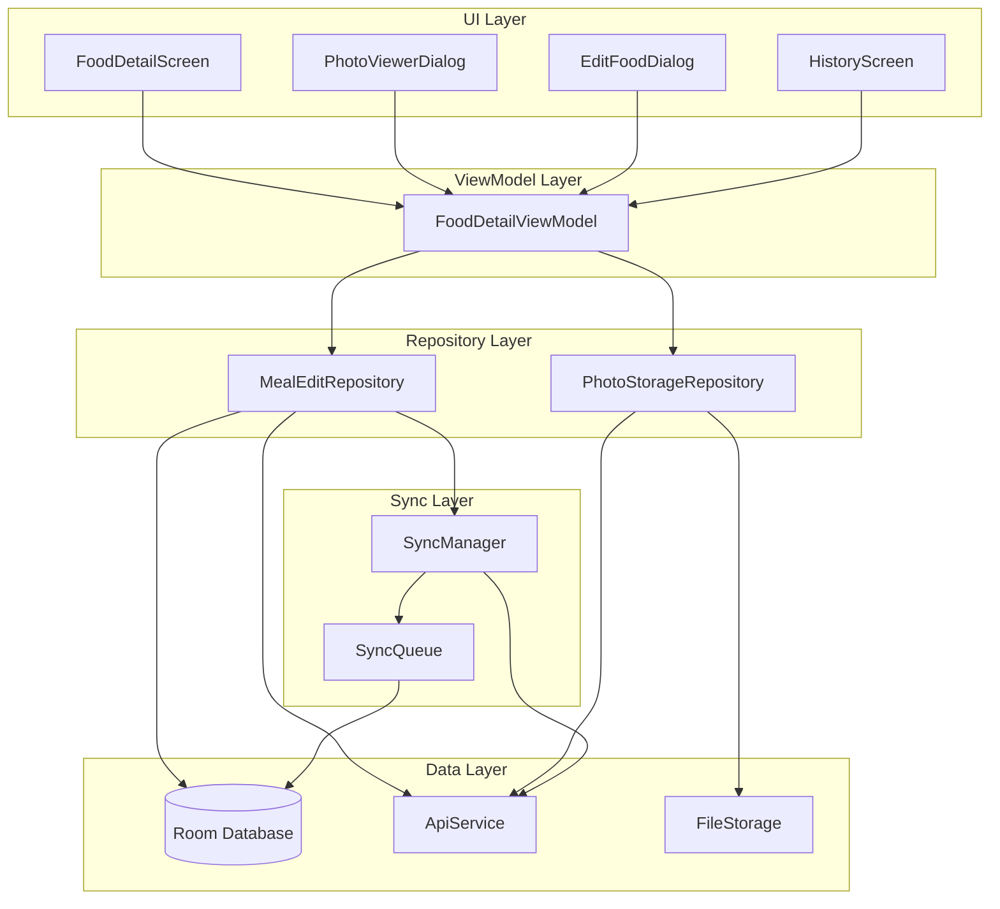

# Design Document: Meal Photo Display & Data Edit

## Overview

本设计文档描述手机端营养追踪应用的"照片展示与饮食数据编辑"功能的技术实现方案。该功能允许用户查看拍摄的食物照片、编辑识别的饮食数据，并实现本地与云端的数据同步。

### 核心功能
1. 照片存储、展示、全屏查看与下载
2. 饮食数据（重量、热量、营养成分）的编辑与验证
3. 本地 Room 数据库持久化
4. 云端数据同步与离线队列

## Architecture



## Components and Interfaces

### 1. UI Components

#### PhotoViewerDialog
全屏照片查看器，支持缩放和下载。

```kotlin
@Composable
fun PhotoViewerDialog(
    imageUri: String?,
    imageUrl: String?,
    onDismiss: () -> Unit,
    onDownload: () -> Unit
)
```

#### EditFoodDialog
食物数据编辑对话框。

```kotlin
@Composable
fun EditFoodDialog(
    food: EditableFoodItem,
    onSave: (EditableFoodItem) -> Unit,
    onCancel: () -> Unit,
    isLoading: Boolean,
    validationErrors: Map<String, String>
)
```

### 2. ViewModel

#### FoodDetailViewModel
管理食物详情页面的状态和业务逻辑。

```kotlin
class FoodDetailViewModel(
    private val mealEditRepository: MealEditRepository,
    private val photoStorageRepository: PhotoStorageRepository,
    private val syncManager: SyncManager
) : ViewModel() {
    
    val uiState: StateFlow<FoodDetailUiState>
    
    fun loadMealSnapshot(snapshotId: String)
    fun editFoodItem(foodId: String, updates: FoodItemUpdates)
    fun saveChanges()
    fun cancelEdit()
    fun downloadPhoto(imageUri: String)
}
```

### 3. Repository Layer

#### MealEditRepository
处理饮食数据的编辑和持久化。

```kotlin
interface MealEditRepository {
    suspend fun getMealSnapshot(snapshotId: String): MealSnapshotWithFoods?
    suspend fun updateFoodItem(foodId: String, updates: FoodItemUpdates): Result<Unit>
    suspend fun getEditHistory(snapshotId: String): List<EditRecord>
    suspend fun syncPendingChanges(): Result<Int>
}
```

#### PhotoStorageRepository
处理照片的存储和访问。

```kotlin
interface PhotoStorageRepository {
    suspend fun getPhotoUri(snapshotId: String): String?
    suspend fun savePhotoToGallery(imageUri: String): Result<Uri>
    suspend fun downloadPhotoFromCloud(imageUrl: String): Result<String>
}
```

### 4. Sync Layer

#### SyncManager
管理数据同步逻辑。

```kotlin
class SyncManager(
    private val syncQueue: SyncQueue,
    private val apiService: ApiService,
    private val connectivityManager: ConnectivityManager
) {
    fun enqueueSyncOperation(operation: SyncOperation)
    suspend fun processPendingOperations()
    fun observeSyncStatus(): Flow<SyncStatus>
}
```

## Data Models

### Database Entities (Room)

#### 更新 MealSnapshotEntity
```kotlin
@Entity(tableName = "meal_snapshots")
data class MealSnapshotEntity(
    @PrimaryKey val id: String,
    val sessionId: String,
    val imageUrl: String,           // 云端 URL
    val localImagePath: String?,    // 本地文件路径
    val capturedAt: Long,
    val model: String = "qwen3-vl-plus",
    val rawJson: String?,
    val totalKcal: Double,
    val isEdited: Boolean = false,  // 新增：是否被编辑过
    val lastSyncedAt: Long? = null  // 新增：最后同步时间
)
```

#### 更新 SnapshotFoodEntity
```kotlin
@Entity(tableName = "snapshot_foods")
data class SnapshotFoodEntity(
    @PrimaryKey val id: String,
    val snapshotId: String,
    val name: String,
    val chineseName: String?,
    // 原始值（AI识别）
    val originalWeightG: Double,
    val originalCaloriesKcal: Double,
    val originalProteinG: Double?,
    val originalCarbsG: Double?,
    val originalFatG: Double?,
    // 当前值（可能被用户编辑）
    val weightG: Double,
    val caloriesKcal: Double,
    val proteinG: Double?,
    val carbsG: Double?,
    val fatG: Double?,
    // 元数据
    val confidence: Double,
    val cookingMethod: String?,
    val isEdited: Boolean = false,
    val editedAt: Long? = null
)
```

#### 新增 SyncQueueEntity
```kotlin
@Entity(tableName = "sync_queue")
data class SyncQueueEntity(
    @PrimaryKey val id: String,
    val operationType: String,      // "update_food", "update_snapshot"
    val targetId: String,           // foodId 或 snapshotId
    val payload: String,            // JSON 格式的更新数据
    val createdAt: Long,
    val retryCount: Int = 0,
    val lastError: String? = null,
    val status: String = "pending"  // pending, syncing, failed, completed
)
```

### UI State Models

```kotlin
data class FoodDetailUiState(
    val snapshot: MealSnapshotWithFoods? = null,
    val photoUri: String? = null,
    val isLoading: Boolean = false,
    val isEditing: Boolean = false,
    val editingFoodId: String? = null,
    val syncStatus: SyncStatus = SyncStatus.Synced,
    val validationErrors: Map<String, String> = emptyMap(),
    val error: String? = null
)

data class EditableFoodItem(
    val id: String,
    val name: String,
    val chineseName: String?,
    val weightG: Double,
    val caloriesKcal: Double,
    val proteinG: Double,
    val carbsG: Double,
    val fatG: Double,
    val originalWeightG: Double,
    val isEdited: Boolean
)

enum class SyncStatus {
    Synced,
    Pending,
    Syncing,
    Failed
}

data class FoodItemUpdates(
    val weightG: Double? = null,
    val caloriesKcal: Double? = null,
    val proteinG: Double? = null,
    val carbsG: Double? = null,
    val fatG: Double? = null,
    val recalculateFromWeight: Boolean = false
)
```

### API Models

#### 更新食物数据请求
```kotlin
data class UpdateFoodRequest(
    @SerializedName("food_id") val foodId: String,
    @SerializedName("weight_g") val weightG: Double?,
    @SerializedName("calories_kcal") val caloriesKcal: Double?,
    @SerializedName("protein_g") val proteinG: Double?,
    @SerializedName("carbs_g") val carbsG: Double?,
    @SerializedName("fat_g") val fatG: Double?,
    @SerializedName("edited_at") val editedAt: Long
)
```

#### 更新食物数据响应
```kotlin
data class UpdateFoodResponse(
    val success: Boolean,
    val message: String,
    @SerializedName("updated_at") val updatedAt: Long
)
```


## Correctness Properties

*A property is a characteristic or behavior that should hold true across all valid executions of a system-essentially, a formal statement about what the system should do. Properties serve as the bridge between human-readable specifications and machine-verifiable correctness guarantees.*

### Property 1: Photo Path Association
*For any* meal snapshot with a captured photo, storing the snapshot SHALL result in the photo path being correctly associated with and retrievable from the snapshot record.
**Validates: Requirements 1.1**

### Property 2: Photo Fallback Behavior
*For any* meal snapshot where the local photo path is null or points to a non-existent file, the system SHALL return the cloud URL as the fallback image source.
**Validates: Requirements 1.4**

### Property 3: Proportional Nutrition Recalculation
*For any* food item with original weight W1 and nutritional values (calories, protein, carbs, fat), when the weight is changed to W2 with recalculation enabled, all nutritional values SHALL be multiplied by the ratio (W2/W1).
**Validates: Requirements 2.2**

### Property 4: Manual Override Preservation
*For any* food item, when a user directly sets a specific nutritional value without enabling recalculation, that exact value SHALL be preserved without modification.
**Validates: Requirements 2.3**

### Property 5: Non-Negative Validation
*For any* set of food item updates, if any numerical value (weight, calories, protein, carbs, fat) is negative, the validation SHALL fail and return an appropriate error.
**Validates: Requirements 2.4**

### Property 6: Edit Cancellation Round-Trip
*For any* food item, after entering edit mode, making changes, and then canceling, the displayed values SHALL equal the values before editing began.
**Validates: Requirements 2.5**

### Property 7: Persistence Round-Trip
*For any* edited food item, saving to the local database and then loading SHALL return values equivalent to what was saved.
**Validates: Requirements 3.2**

### Property 8: Dual Value Storage
*For any* edited food item, both the original AI-recognized values and the user-edited values SHALL be stored and independently retrievable.
**Validates: Requirements 3.3**

### Property 9: Display Value Selection
*For any* food item, if `isEdited` is true, the displayed values SHALL be the edited values; otherwise, the displayed values SHALL be the original values.
**Validates: Requirements 3.4**

### Property 10: Sync Success State Update
*For any* successful sync operation, the corresponding local record SHALL have its sync status updated to "synced" and `lastSyncedAt` timestamp set.
**Validates: Requirements 4.2**

### Property 11: Sync Failure Queue Entry
*For any* failed sync operation due to network issues, a queue entry SHALL be created with the operation details and "pending" status.
**Validates: Requirements 4.3**

### Property 12: Chronological Sync Order
*For any* set of pending sync operations, when processed, they SHALL be executed in chronological order based on their creation timestamp.
**Validates: Requirements 4.4**

### Property 13: Conflict Resolution by Timestamp
*For any* conflict between local and cloud data versions, the version with the more recent `editedAt` timestamp SHALL be selected as the authoritative version.
**Validates: Requirements 4.5**

## Error Handling

### Network Errors
- **Connection Timeout**: Queue the sync operation for retry, show "pending sync" indicator
- **Server Error (5xx)**: Retry with exponential backoff (max 3 retries), then mark as failed
- **Client Error (4xx)**: Log error, do not retry, notify user of data issue

### Data Validation Errors
- **Negative Values**: Show inline error message, prevent save
- **Invalid Format**: Show format hint, preserve user input for correction
- **Missing Required Fields**: Highlight missing fields, prevent save

### Storage Errors
- **Database Write Failure**: Retry once, then show error dialog with retry option
- **File System Error (photo save)**: Show error toast, suggest retry
- **Insufficient Storage**: Show storage warning, suggest cleanup

### Photo Loading Errors
- **Local File Missing**: Fallback to cloud URL
- **Cloud URL Failed**: Show placeholder image with retry button
- **Both Failed**: Show error placeholder with "Photo unavailable" message

## Testing Strategy

### Property-Based Testing Framework
本项目使用 **Kotest** 作为属性测试框架，配合 **Kotest Property Testing** 模块进行属性测试。

```kotlin
// build.gradle.kts
testImplementation("io.kotest:kotest-runner-junit5:5.8.0")
testImplementation("io.kotest:kotest-property:5.8.0")
```

### Property Test Requirements
- 每个属性测试必须运行至少 **100 次迭代**
- 每个属性测试必须使用注释标注对应的正确性属性：`// **Feature: meal-photo-edit, Property {number}: {property_text}**`
- 每个正确性属性由单独的属性测试实现

### Unit Tests
单元测试覆盖以下关键组件：
- `NutritionCalculator`: 营养值按比例计算逻辑
- `FoodItemValidator`: 数据验证逻辑
- `SyncQueue`: 队列操作（入队、出队、排序）
- `ConflictResolver`: 冲突解决逻辑

### Integration Tests
集成测试覆盖：
- Room 数据库读写操作
- API 同步流程（使用 MockWebServer）
- 照片存储与加载流程

### Test File Structure
```
android-phone/app/src/test/kotlin/com/rokid/nutrition/phone/
├── repository/
│   ├── MealEditRepositoryTest.kt
│   └── PhotoStorageRepositoryTest.kt
├── sync/
│   ├── SyncManagerTest.kt
│   └── SyncQueueTest.kt
├── util/
│   ├── NutritionCalculatorTest.kt
│   └── FoodItemValidatorTest.kt
└── property/
    ├── NutritionCalculationPropertyTest.kt
    ├── DataPersistencePropertyTest.kt
    └── SyncBehaviorPropertyTest.kt
```

