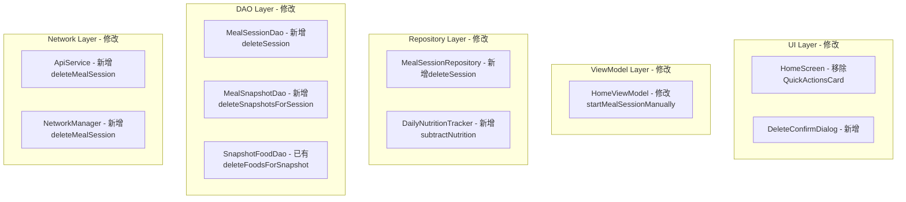

# Design Document: Phone App Meal Improvements

## Overview

This design document describes the implementation of meal monitoring improvements for the phone app. The changes include UI reorganization, baseline photo capture flow, swipe-to-end meal support, meal record deletion with data synchronization, and food editing in the latest recognition section.

**设计原则：复用现有代码，最小化新增代码**

## Architecture

复用现有的 MVVM 架构，主要修改以下组件：



## Components and Interfaces

### 1. HomeScreen UI Changes

**修改 HomeScreen.kt**：移除 `QuickActionsCard`，调整布局顺序

```kotlin
// HomeScreen.kt - 修改 Column 内容顺序
Column {
    GlassesStatusCard(...)
    Spacer(...)
    
    // Status message (if any)
    if (uiState.statusMessage.isNotEmpty()) { ... }
    
    // 删除这段代码:
    // if (isConnected) {
    //     QuickActionsCard(onTakePhotoClick = onTakePhotoClick)
    //     Spacer(modifier = Modifier.height(16.dp))
    // }
    
    // Meal Status Card - 保持原位置（已经在 QuickActionsCard 之后）
    MealStatusCard(...)
    
    // Latest Recognition
    if (uiState.latestResult != null) {
        LatestResultCardWithPhoto(...)
    }
    
    // Recent Meals - 添加 onSessionLongPress 参数
    RecentMealsCardWithPhotos(
        sessionsWithPhotos = recentSessionsWithPhotos,
        onSessionClick = onSessionClick,
        onSessionLongPress = onSessionDelete  // 新增
    )
}
```

**修改 MealStatusCard**：添加连接状态检查

```kotlin
// 修改现有的 MealStatusCard，在 Button 中添加 enabled 条件
Button(
    onClick = onStartMealSession,
    enabled = isConnected && !isProcessing,  // 新增条件
    colors = ButtonDefaults.buttonColors(
        containerColor = Color(0xFF4CAF50)
    ),
    modifier = Modifier.height(40.dp)
) {
    if (isProcessing) {
        CircularProgressIndicator(modifier = Modifier.size(18.dp), strokeWidth = 2.dp)
    } else {
        Icon(Icons.Default.PlayArrow, ...)
    }
    Spacer(modifier = Modifier.width(4.dp))
    Text(if (isProcessing) "处理中..." else "开始用餐", fontSize = 13.sp)
}
```

### 2. HomeViewModel - 修改 startMealSessionManually

**修改现有的 `startMealSessionManually()` 方法**，添加基线照片拍摄：

```kotlin
// 修改 HomeViewModel.kt 中的 startMealSessionManually()
fun startMealSessionManually() {
    viewModelScope.launch {
        // 检查眼镜连接
        if (!bluetoothManager.isConnected()) {
            _uiState.update { it.copy(statusMessage = "请先连接眼镜") }
            return@launch
        }
        
        _uiState.update { 
            it.copy(isProcessing = true, statusMessage = "正在拍摄基线照片...") 
        }
        
        // 使用现有的 takeGlassPhoto 方法
        bluetoothManager.takeGlassPhoto(1920, 1080, 85) { imageData ->
            if (imageData != null && imageData.isNotEmpty()) {
                // 复用现有的 handleImageReceived 逻辑
                viewModelScope.launch {
                    handleBaselineImageReceived(ImageData(
                        data = imageData,
                        format = "jpeg",
                        timestamp = System.currentTimeMillis(),
                        isManualCapture = true
                    ))
                }
            } else {
                _uiState.update { 
                    it.copy(isProcessing = false, statusMessage = "拍照失败，请重试") 
                }
            }
        }
    }
}

// 新增：处理基线照片（复用 handleNewAnalysis 的大部分逻辑）
private suspend fun handleBaselineImageReceived(imageData: ImageData) {
    bluetoothManager.notifyAiStart()
    bluetoothManager.notifyUploading()
    
    var uploadedImageUrl = ""
    
    val result = networkManager.uploadAndAnalyzeWithProgress(
        imageData = imageData.data,
        userProfile = userProfile?.let { UserProfilePayload(...) },
        onUploadComplete = { imageUrl ->
            uploadedImageUrl = imageUrl
            bluetoothManager.notifyAnalyzing()
            _uiState.update { it.copy(statusMessage = "识别菜品中...") }
        },
        onAnalyzeComplete = {
            bluetoothManager.notifyCalculating()
            _uiState.update { it.copy(statusMessage = "创建用餐会话...") }
        }
    )
    
    result.fold(
        onSuccess = { response ->
            bluetoothManager.notifyComplete()
            
            // 强制开始会话（不管食物类型）
            sessionStartTime = System.currentTimeMillis()
            startMealSessionInternal(response, uploadedImageUrl)
            
            // 更新 UI
            val nutritionResult = buildNutritionResult(response)
            _uiState.update {
                it.copy(
                    isProcessing = false,
                    statusMessage = "用餐监测已开始",
                    latestResult = nutritionResult,
                    latestImageUrl = uploadedImageUrl,
                    hasActiveSession = true,
                    sessionStatus = "用餐中",
                    sessionStartTime = sessionStartTime
                )
            }
        },
        onFailure = { e ->
            handleAnalysisError(e)
            _uiState.update { it.copy(isProcessing = false) }
        }
    )
}
```

### 3. Meal Record Deletion

#### 3.1 MealSessionDao - 新增删除方法

```kotlin
// 在 Daos.kt 的 MealSessionDao 中添加
@Query("DELETE FROM meal_sessions WHERE sessionId = :sessionId")
suspend fun deleteSession(sessionId: String)
```

#### 3.2 MealSnapshotDao - 新增删除方法

```kotlin
// 在 Daos.kt 的 MealSnapshotDao 中添加
@Query("DELETE FROM meal_snapshots WHERE sessionId = :sessionId")
suspend fun deleteSnapshotsForSession(sessionId: String)

@Query("SELECT id FROM meal_snapshots WHERE sessionId = :sessionId")
suspend fun getSnapshotIdsForSession(sessionId: String): List<String>
```

#### 3.3 MealSessionRepository - 新增删除方法

```kotlin
// 在 MealSessionRepository.kt 中添加
suspend fun deleteSession(sessionId: String): Result<Unit> {
    return try {
        // 1. 获取所有快照ID
        val snapshotIds = snapshotDao.getSnapshotIdsForSession(sessionId)
        
        // 2. 删除所有快照的食物
        snapshotIds.forEach { snapshotId ->
            foodDao.deleteFoodsForSnapshot(snapshotId)  // 已有方法
        }
        
        // 3. 删除快照
        snapshotDao.deleteSnapshotsForSession(sessionId)
        
        // 4. 删除会话
        sessionDao.deleteSession(sessionId)
        
        Log.d(TAG, "会话已删除: $sessionId")
        Result.success(Unit)
    } catch (e: Exception) {
        Log.e(TAG, "删除会话失败", e)
        Result.failure(e)
    }
}
```

#### 3.4 DailyNutritionTracker - 新增减法方法

```kotlin
// 在 DailyNutritionTracker.kt 中添加
fun subtractNutrition(calories: Double, protein: Double, carbs: Double, fat: Double) {
    if (isNewDay()) {
        resetDailyTotals()
        return  // 新的一天，不需要减
    }
    
    val currentCalories = prefs.getFloat(KEY_DAILY_CALORIES, 0f)
    val currentProtein = prefs.getFloat(KEY_DAILY_PROTEIN, 0f)
    val currentCarbs = prefs.getFloat(KEY_DAILY_CARBS, 0f)
    val currentFat = prefs.getFloat(KEY_DAILY_FAT, 0f)
    val currentMealCount = prefs.getInt(KEY_MEAL_COUNT, 0)
    
    prefs.edit()
        .putFloat(KEY_DAILY_CALORIES, maxOf(0f, currentCalories - calories.toFloat()))
        .putFloat(KEY_DAILY_PROTEIN, maxOf(0f, currentProtein - protein.toFloat()))
        .putFloat(KEY_DAILY_CARBS, maxOf(0f, currentCarbs - carbs.toFloat()))
        .putFloat(KEY_DAILY_FAT, maxOf(0f, currentFat - fat.toFloat()))
        .putInt(KEY_MEAL_COUNT, maxOf(0, currentMealCount - 1))
        .apply()
    
    Log.d(TAG, "减去营养: -$calories kcal")
}
```

#### 3.5 ApiService & NetworkManager - 新增删除 API

```kotlin
// ApiService.kt 添加
@DELETE("/api/v1/meal/session/{session_id}")
suspend fun deleteMealSession(@Path("session_id") sessionId: String): DeleteMealResponse

// NetworkManager.kt 添加
suspend fun deleteMealSession(sessionId: String): Result<DeleteMealResponse> {
    return withRetry {
        DebugLogger.i(TAG, "删除用餐会话: sessionId=$sessionId")
        api.deleteMealSession(sessionId)
    }
}
```

#### 3.6 HomeViewModel - 新增删除方法

```kotlin
// HomeViewModel.kt 添加
fun deleteMealSession(session: MealSessionEntity) {
    viewModelScope.launch {
        try {
            // 1. 删除本地数据
            sessionRepository.deleteSession(session.sessionId)
            
            // 2. 如果是今天的记录，更新 DailyNutritionTracker
            if (isToday(session.startTime)) {
                dailyNutritionTracker.subtractNutrition(
                    calories = session.totalConsumedKcal ?: 0.0,
                    protein = 0.0,  // 会话实体中没有详细营养数据
                    carbs = 0.0,
                    fat = 0.0
                )
            }
            
            // 3. 调用后端 API（失败时加入离线队列）
            val result = networkManager.deleteMealSession(session.sessionId)
            result.onFailure { e ->
                Log.w(TAG, "后端删除失败，已加入离线队列", e)
                // 使用现有的 SyncQueue 机制
            }
            
            _uiState.update { it.copy(statusMessage = "记录已删除") }
        } catch (e: Exception) {
            Log.e(TAG, "删除失败", e)
            _uiState.update { it.copy(statusMessage = "删除失败") }
        }
    }
}

private fun isToday(timestamp: Long): Boolean {
    val today = java.util.Calendar.getInstance()
    val target = java.util.Calendar.getInstance().apply { timeInMillis = timestamp }
    return today.get(java.util.Calendar.YEAR) == target.get(java.util.Calendar.YEAR) &&
           today.get(java.util.Calendar.DAY_OF_YEAR) == target.get(java.util.Calendar.DAY_OF_YEAR)
}
```

### 4. Latest Recognition Editing

**复用现有的 FoodDetailScreen 和 EditFoodDialog**

#### 4.1 修改 HomeScreen 的 onLatestResultClick

```kotlin
// 修改 HomeScreen 参数，添加 sessionId
onLatestResultClick = {
    // 使用 latestSessionId 导航到详情页
    if (uiState.latestSessionId != null) {
        navController.navigate("food_detail/${uiState.latestSessionId}")
    }
}
```

#### 4.2 确保 latestSessionId 正确设置

在 `handleNewAnalysis` 和 `handleBaselineImageReceived` 中已经设置了 `latestSessionId`，
FoodDetailScreen 已经支持编辑功能，无需额外修改。

### 5. Delete Confirmation Dialog

```kotlin
// 新增 DeleteMealConfirmDialog.kt
@Composable
fun DeleteMealConfirmDialog(
    session: MealSessionEntity,
    onConfirm: () -> Unit,
    onDismiss: () -> Unit
) {
    AlertDialog(
        onDismissRequest = onDismiss,
        title = { Text("删除用餐记录") },
        text = { 
            Text("确定要删除这条用餐记录吗？\n热量: ${session.totalConsumedKcal?.toInt() ?: 0} kcal\n此操作无法撤销。") 
        },
        confirmButton = {
            TextButton(onClick = onConfirm) {
                Text("删除", color = Color.Red)
            }
        },
        dismissButton = {
            TextButton(onClick = onDismiss) {
                Text("取消")
            }
        }
    )
}
```

### 6. RecentMealsCardWithPhotos - 添加长按支持

```kotlin
// 修改 MealSessionItemWithPhoto，添加长按手势
@OptIn(ExperimentalFoundationApi::class)
@Composable
private fun MealSessionItemWithPhoto(
    sessionWithPhoto: MealSessionWithPhoto,
    onClick: () -> Unit,
    onLongPress: () -> Unit  // 新增
) {
    Row(
        modifier = Modifier
            .fillMaxWidth()
            .combinedClickable(
                onClick = onClick,
                onLongClick = onLongPress
            )
            .padding(vertical = 8.dp),
        ...
    )
}
```

## Data Models

### DeleteMealResponse (新增)

```kotlin
data class DeleteMealResponse(
    val success: Boolean,
    val message: String
)
```

### HomeUiState (修改)

```kotlin
data class HomeUiState(
    // 现有字段...
    val showDeleteDialog: Boolean = false,        // 新增
    val sessionToDelete: MealSessionEntity? = null  // 新增
)
```

## Correctness Properties

*A property is a characteristic or behavior that should hold true across all valid executions of a system-essentially, a formal statement about what the system should do. Properties serve as the bridge between human-readable specifications and machine-verifiable correctness guarantees.*

### Property 1: Connection state determines button availability
*For any* connection state, if the state is not Connected, then the "开始用餐" button should be disabled
**Validates: Requirements 2.5**

### Property 2: Baseline photo triggers session creation
*For any* successful baseline photo capture and analysis, a meal session should be created with nutrition data matching the analysis response
**Validates: Requirements 2.2, 2.3**

### Property 3: Failed capture prevents session creation
*For any* failed baseline photo capture, no meal session should be created and the UI should show an error state
**Validates: Requirements 2.4**

### Property 4: Session end updates status
*For any* successful session end (whether via backend success or failure), the UI status should transition to "空闲" and hasActiveSession should be false
**Validates: Requirements 3.3, 3.5**

### Property 5: Session end updates daily tracker
*For any* successful session end, the Daily_Nutrition_Tracker should be updated with the consumed calories from that session
**Validates: Requirements 3.4**

### Property 6: Deletion removes from local database
*For any* confirmed meal deletion, the session should no longer exist in the local database
**Validates: Requirements 4.2**

### Property 7: Today's deletion updates daily tracker
*For any* deleted meal session from today, the Daily_Nutrition_Tracker totals should be reduced by the session's nutrition values
**Validates: Requirements 4.5**

### Property 8: Food edit persists locally
*For any* saved food edit, the updated values should be retrievable from the local database
**Validates: Requirements 5.4**

### Property 9: Nutrition totals recalculation
*For any* food edit, the total nutrition values should equal the sum of all individual food items' values
**Validates: Requirements 6.3**

## Error Handling

### Baseline Photo Capture Errors
- **Camera not available**: Display "眼镜相机不可用" and abort
- **Bluetooth disconnection during capture**: Display "连接中断" and abort
- **Upload timeout**: Display "上传超时，请重试" and abort
- **Analysis failure**: Display "识别失败，请重试" and abort

### Deletion Errors
- **Local database error**: Display error and do not proceed with backend call
- **Backend API error**: Queue for retry, show warning toast
- **Network unavailable**: Queue for retry, show offline indicator

### Edit Sync Errors
- **Validation failure**: Show inline error messages, prevent save
- **Backend sync failure**: Mark as "pending sync", queue for retry

## Testing Strategy

### Unit Testing
- Test HomeViewModel state transitions for meal session start/end
- Test DailyNutritionTracker subtraction logic
- Test input validation in EditFoodDialog

### Property-Based Testing
Using **Kotest** property-based testing library for Kotlin:

- Configure minimum 100 iterations per property test
- Tag each test with format: `**Feature: phone-app-meal-improvements, Property {number}: {property_text}**`

Property tests will cover:
1. Connection state → button availability mapping
2. Baseline capture success → session creation
3. Baseline capture failure → no session creation
4. Session end → status update
5. Session end → daily tracker update
6. Deletion → local database removal
7. Today's deletion → daily tracker update
8. Food edit → local persistence
9. Edit → totals recalculation

### Integration Testing
- End-to-end meal session flow with mock Bluetooth
- Deletion flow with mock backend
- Edit flow with sync verification
