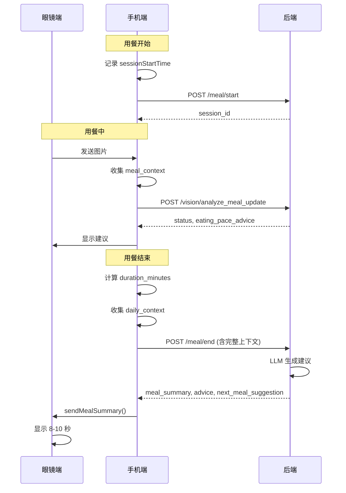

# Design Document: Smart Meal Advice

## Overview

本设计文档描述了智能用餐建议系统的改进方案。系统将在各个接口中增强建议生成能力，前端负责收集和传递完整的上下文数据，后端各接口根据场景生成针对性的建议。核心改进包括：

1. **前端数据收集** - 用餐时长追踪、今日摄入统计、用户档案传递
2. **后端接口增强** - 各接口增加上下文参数和建议返回字段
3. **眼镜端显示** - 用餐结束时显示营养总结和简短建议

## Architecture



## Components and Interfaces

### 1. 前端组件

#### 1.1 MealContextCollector

负责收集用餐上下文数据。

```kotlin
data class MealContext(
    val sessionId: String,
    val startTime: Long,
    val durationMinutes: Double,
    val recognitionCount: Int,
    val totalConsumedSoFar: Double,
    val eatingSpeed: String  // "fast" | "normal" | "slow"
)

fun collectMealContext(): MealContext {
    val duration = (System.currentTimeMillis() - sessionStartTime) / 60000.0
    val eatingSpeed = classifyEatingSpeed(duration)
    return MealContext(
        sessionId = currentSessionId,
        startTime = sessionStartTime,
        durationMinutes = duration,
        recognitionCount = recognitionHistory.size,
        totalConsumedSoFar = totalCalories,
        eatingSpeed = eatingSpeed
    )
}

fun classifyEatingSpeed(durationMinutes: Double): String {
    return when {
        durationMinutes < 10 -> "fast"
        durationMinutes in 15.0..30.0 -> "normal"
        durationMinutes > 45 -> "slow"
        else -> "normal"
    }
}
```

#### 1.2 DailyNutritionTracker

负责追踪今日营养摄入。

```kotlin
data class DailyContext(
    val totalCaloriesToday: Double,
    val totalProteinToday: Double,
    val totalCarbsToday: Double,
    val totalFatToday: Double,
    val mealCountToday: Int,
    val lastMealHoursAgo: Double
)

class DailyNutritionTracker(private val prefs: SharedPreferences) {
    
    fun updateDailyTotals(mealNutrition: NutritionTotal) {
        // 检查是否是新的一天
        if (isNewDay()) {
            resetDailyTotals()
        }
        
        // 累加今日摄入
        val currentCalories = prefs.getFloat("daily_calories", 0f)
        prefs.edit()
            .putFloat("daily_calories", currentCalories + mealNutrition.calories.toFloat())
            .putFloat("daily_protein", prefs.getFloat("daily_protein", 0f) + mealNutrition.protein.toFloat())
            .putFloat("daily_carbs", prefs.getFloat("daily_carbs", 0f) + mealNutrition.carbs.toFloat())
            .putFloat("daily_fat", prefs.getFloat("daily_fat", 0f) + mealNutrition.fat.toFloat())
            .putInt("meal_count", prefs.getInt("meal_count", 0) + 1)
            .putLong("last_meal_time", System.currentTimeMillis())
            .putString("last_update_date", getCurrentDateString())
            .apply()
    }
    
    fun getDailyContext(): DailyContext {
        val lastMealTime = prefs.getLong("last_meal_time", 0)
        val hoursAgo = if (lastMealTime > 0) {
            (System.currentTimeMillis() - lastMealTime) / 3600000.0
        } else 0.0
        
        return DailyContext(
            totalCaloriesToday = prefs.getFloat("daily_calories", 0f).toDouble(),
            totalProteinToday = prefs.getFloat("daily_protein", 0f).toDouble(),
            totalCarbsToday = prefs.getFloat("daily_carbs", 0f).toDouble(),
            totalFatToday = prefs.getFloat("daily_fat", 0f).toDouble(),
            mealCountToday = prefs.getInt("meal_count", 0),
            lastMealHoursAgo = hoursAgo
        )
    }
    
    private fun isNewDay(): Boolean {
        val lastDate = prefs.getString("last_update_date", "")
        return lastDate != getCurrentDateString()
    }
    
    private fun resetDailyTotals() {
        prefs.edit()
            .putFloat("daily_calories", 0f)
            .putFloat("daily_protein", 0f)
            .putFloat("daily_carbs", 0f)
            .putFloat("daily_fat", 0f)
            .putInt("meal_count", 0)
            .apply()
    }
}
```

#### 1.3 BluetoothManager 扩展

新增用餐总结发送方法。

```kotlin
/**
 * 发送用餐总结到眼镜
 * 
 * Caps 结构:
 * [0] Float: 总热量 (kcal)
 * [1] Float: 蛋白质 (g)
 * [2] Float: 碳水化合物 (g)
 * [3] Float: 脂肪 (g)
 * [4] Float: 用餐时长 (分钟)
 * [5] String: 评级 ("good" | "fair" | "poor")
 * [6] String: 简短建议 (≤20字符)
 */
fun sendMealSummary(summary: MealSummary): Boolean {
    if (!isConnected()) {
        Log.w(TAG, "眼镜未连接，跳过发送用餐总结")
        return false
    }
    
    try {
        val caps = Caps().apply {
            writeFloat(summary.totalCalories.toFloat())
            writeFloat(summary.totalProtein.toFloat())
            writeFloat(summary.totalCarbs.toFloat())
            writeFloat(summary.totalFat.toFloat())
            writeFloat(summary.durationMinutes.toFloat())
            write(summary.rating)
            write(summary.shortAdvice.take(20))  // 限制 20 字符
        }
        cxrApi.sendCustomCmd(Config.MsgName.MEAL_SUMMARY, caps)
        Log.d(TAG, "发送用餐总结: ${summary.totalCalories} kcal, ${summary.durationMinutes} min")
        return true
    } catch (e: Exception) {
        Log.e(TAG, "发送用餐总结失败", e)
        return false
    }
}
```

### 2. 后端接口增强

#### 2.1 `/api/v1/vision/analyze` 增强

**新增请求参数:**

```python
class VisionAnalyzeRequest(BaseModel):
    image_url: str
    question: Optional[str] = None
    locale: str = "zh"
    user_profile: Optional[UserProfilePayload] = None
    daily_context: Optional[DailyContextPayload] = None  # 新增
    is_meal_active: bool = False  # 新增

class DailyContextPayload(BaseModel):
    total_calories_today: float = 0
    total_protein_today: float = 0
    total_carbs_today: float = 0
    total_fat_today: float = 0
    meal_count_today: int = 0
    last_meal_hours_ago: float = 0
```

**新增响应字段:**

```python
# 在 raw_llm 中增加
{
    "suggestion": "蛋白质丰富，搭配蔬菜更均衡",  # 眼镜显示
    "health_tips": [  # 手机显示
        "本餐蛋白质含量较高",
        "建议搭配绿叶蔬菜"
    ]
}
```

#### 2.2 `/api/v1/vision/analyze_meal_update` 增强

**新增请求参数:**

```python
class MealUpdateAnalyzeRequest(BaseModel):
    image_url: str
    baseline_foods: List[BaselineFood]
    meal_context: Optional[MealContextPayload] = None  # 新增

class MealContextPayload(BaseModel):
    session_id: str
    start_time: int  # 毫秒时间戳
    duration_minutes: float
    recognition_count: int
    total_consumed_so_far: float
```

**新增响应字段:**

```python
{
    "status": "accept",
    "message": "已更新",
    "eating_pace_advice": "进食速度适中，继续保持",  # 新增
    "progress_summary": "已摄入 450 kcal，约占本餐 60%"  # 新增
}
```

#### 2.3 `/api/v1/meal/end` 增强

**新增请求参数:**

```python
class MealEndRequest(BaseModel):
    session_id: str
    final_snapshot: Optional[SnapshotPayload] = None
    meal_context: Optional[MealContextPayload] = None  # 新增
    daily_context: Optional[DailyContextPayload] = None  # 新增
    user_profile: Optional[UserProfilePayload] = None  # 新增
```

**新增响应字段:**

```python
{
    "session_id": "xxx",
    "final_stats": {...},
    "report": "...",
    "message": "用餐记录已完成",
    
    # 新增字段
    "meal_summary": {  # 眼镜显示
        "total_calories": 650,
        "total_protein": 35,
        "total_carbs": 80,
        "total_fat": 20,
        "duration_minutes": 25,
        "rating": "good",
        "short_advice": "营养均衡，继续保持！"
    },
    "advice": {  # 手机显示
        "summary": "本餐营养均衡，蛋白质摄入充足",
        "suggestions": [
            "用餐时长适中，有助于消化",
            "今日蛋白质摄入已达标",
            "建议下一餐增加蔬菜摄入"
        ],
        "highlights": ["蛋白质充足", "用餐节奏健康"],
        "warnings": []
    },
    "next_meal_suggestion": {  # 下一餐建议
        "recommended_time": "4小时后",
        "meal_type": "晚餐",
        "calorie_budget": 600,
        "focus_nutrients": ["蔬菜", "膳食纤维"],
        "avoid": ["高糖食物"]
    }
}
```

## Data Models

### 前端数据模型

```kotlin
// 用餐上下文
data class MealContext(
    val sessionId: String,
    val startTime: Long,
    val durationMinutes: Double,
    val recognitionCount: Int,
    val totalConsumedSoFar: Double,
    val eatingSpeed: String
)

// 今日上下文
data class DailyContext(
    val totalCaloriesToday: Double,
    val totalProteinToday: Double,
    val totalCarbsToday: Double,
    val totalFatToday: Double,
    val mealCountToday: Int,
    val lastMealHoursAgo: Double
)

// 用餐总结（眼镜显示）
data class MealSummary(
    val totalCalories: Double,
    val totalProtein: Double,
    val totalCarbs: Double,
    val totalFat: Double,
    val durationMinutes: Double,
    val rating: String,
    val shortAdvice: String
)

// 详细建议（手机显示）
data class MealAdvice(
    val summary: String,
    val suggestions: List<String>,
    val highlights: List<String>,
    val warnings: List<String>
)

// 下一餐建议
data class NextMealSuggestion(
    val recommendedTime: String,
    val mealType: String,
    val calorieBudget: Double,
    val focusNutrients: List<String>,
    val avoid: List<String>
)
```

### 后端数据模型

```python
# 用餐上下文
class MealContextPayload(BaseModel):
    session_id: str
    start_time: int
    duration_minutes: float
    recognition_count: int
    total_consumed_so_far: float

# 今日上下文
class DailyContextPayload(BaseModel):
    total_calories_today: float = 0
    total_protein_today: float = 0
    total_carbs_today: float = 0
    total_fat_today: float = 0
    meal_count_today: int = 0
    last_meal_hours_ago: float = 0

# 用餐总结
class MealSummaryResponse(BaseModel):
    total_calories: float
    total_protein: float
    total_carbs: float
    total_fat: float
    duration_minutes: float
    rating: str  # "good" | "fair" | "poor"
    short_advice: str

# 详细建议
class MealAdviceResponse(BaseModel):
    summary: str
    suggestions: List[str]
    highlights: List[str]
    warnings: List[str]

# 下一餐建议
class NextMealSuggestionResponse(BaseModel):
    recommended_time: str
    meal_type: str
    calorie_budget: float
    focus_nutrients: List[str]
    avoid: List[str]
```

## Correctness Properties

*A property is a characteristic or behavior that should hold true across all valid executions of a system-essentially, a formal statement about what the system should do. Properties serve as the bridge between human-readable specifications and machine-verifiable correctness guarantees.*

### Property 1: Suggestion Length Constraint

*For any* vision analyze response, the `suggestion` field SHALL be under 30 Chinese characters.

**Validates: Requirements 1.5**
### Property 2: Meal End Response Structure

*For any* meal end response, the response SHALL contain both `meal_summary` and `advice` fields with all required sub-fields.a

**Validates: Requirements 3.1, 3.2**

### Property 3: Glasses Summary Structure

*For any* meal summary sent to glasses, it SHALL include calories, protein, carbs, fat, duration, and a short advice under 20 characters.

**Validates: Requirements 4.2, 4.3**

### Property 4: Duration Classification

*For any* meal duration value:
- duration < 10 minutes → classified as "fast"
- 15 ≤ duration ≤ 30 minutes → classified as "normal"
- duration > 45 minutes → classified as "slow"

**Validates: Requirements 5.4, 5.5, 5.6**

### Property 5: Duration Calculation

*For any* meal session with start time S and end time E, the duration in minutes SHALL equal `(E - S) / 60000`.

**Validates: Requirements 5.2**

### Property 6: Daily Totals Calculation

*For any* sequence of meals in a day, the daily totals SHALL equal the sum of individual meal values for calories, protein, carbs, and fat.

**Validates: Requirements 6.2**

### Property 7: Meal Context Inclusion

*For any* meal end request, the request payload SHALL include `duration_minutes` in the meal_context field.

**Validates: Requirements 5.3**

### Property 8: Daily Context Inclusion

*For any* meal end request, the request payload SHALL include daily_context with today's nutrition totals.

**Validates: Requirements 6.3**

### Property 9: Daily Reset on New Day

*For any* daily nutrition tracker, when a new day starts (date changes), all daily totals SHALL be reset to zero.

**Validates: Requirements 6.4**

### Property 10: Calorie Excess Flag

*For any* daily context where total calories exceed the target, the system SHALL flag it for advice generation.

**Validates: Requirements 6.5**

## Error Handling

### 前端错误处理

1. **眼镜断开连接**
   - 跳过 `sendMealSummary()` 调用
   - 仅更新手机端 UI
   - 记录日志但不显示错误

2. **网络请求失败**
   - 使用本地缓存的数据生成基础建议
   - 显示"网络不稳定，建议仅供参考"提示
   - 重试机制（最多 3 次）

3. **数据解析错误**
   - 使用默认值填充缺失字段
   - 记录错误日志
   - 显示基础统计信息

### 后端错误处理

1. **LLM 调用失败**
   - 回退到规则引擎生成建议
   - 返回基础统计数据
   - 记录错误日志

2. **缺少上下文数据**
   - 使用默认值
   - 生成通用建议
   - 在响应中标注数据不完整

## Testing Strategy

### 单元测试

1. **Duration Classification Tests**
   - 测试各种时长值的分类结果
   - 边界值测试（10, 15, 30, 45 分钟）

2. **Daily Totals Calculation Tests**
   - 测试多餐累加
   - 测试日期切换重置

3. **Data Model Serialization Tests**
   - 测试 JSON 序列化/反序列化
   - 测试可选字段处理

### Property-Based Tests

使用 Kotest 的 property testing 功能：

1. **Duration Classification Property**
   - 生成随机时长值
   - 验证分类结果符合规则

2. **Daily Totals Property**
   - 生成随机营养数据序列
   - 验证累加结果正确

3. **Response Structure Property**
   - 生成随机响应数据
   - 验证必需字段存在

### 集成测试

1. **End-to-End Meal Flow**
   - 模拟完整用餐流程
   - 验证数据在各组件间正确传递

2. **Bluetooth Communication**
   - 模拟眼镜连接/断开
   - 验证错误处理正确

