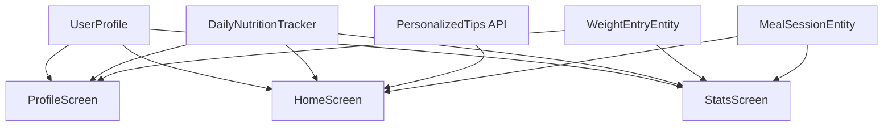

# Design Document

## Overview

本设计文档描述了 VISEAT 食智 App 的 UI 界面重新设计方案，包括 ProfileScreen（我的页面）、HomeScreen（首页）和 StatsScreen（统计页面）的重新设计，以及 OnboardingScreen 的输入方式优化。

设计目标是打造一个完整的健康管理应用体验，结合已收集的用户信息（Onboarding 数据）提供个性化的健康管理体验，采用 Apple 风格的现代化 UI 设计。

## Architecture

### 整体架构

```
┌─────────────────────────────────────────────────────────────┐
│                        UI Layer                              │
│  ┌─────────────┐  ┌─────────────┐  ┌─────────────┐          │
│  │ProfileScreen│  │ HomeScreen  │  │ StatsScreen │          │
│  └──────┬──────┘  └──────┬──────┘  └──────┬──────┘          │
│         │                │                │                  │
│  ┌──────┴────────────────┴────────────────┴──────┐          │
│  │              Shared Components                 │          │
│  │  (Cards, Progress Indicators, Wheel Pickers)  │          │
│  └───────────────────────┬───────────────────────┘          │
├──────────────────────────┼──────────────────────────────────┤
│                    ViewModel Layer                           │
│  ┌─────────────┐  ┌─────────────┐  ┌─────────────┐          │
│  │ProfileVM    │  │  HomeVM     │  │  StatsVM    │          │
│  └──────┬──────┘  └──────┬──────┘  └──────┬──────┘          │
├─────────┴────────────────┴────────────────┴─────────────────┤
│                    Repository Layer                          │
│  ┌─────────────────────────────────────────────────────┐    │
│  │  UserProfileRepository  │  MealSessionRepository    │    │
│  │  DailyNutritionTracker  │  StatisticsRepository     │    │
│  └─────────────────────────────────────────────────────┘    │
├─────────────────────────────────────────────────────────────┤
│                      Data Layer                              │
│  ┌─────────────────────────────────────────────────────┐    │
│  │  Room Database  │  SharedPreferences  │  Network    │    │
│  └─────────────────────────────────────────────────────┘    │
└─────────────────────────────────────────────────────────────┘
```

### 数据流



## Components and Interfaces

### 1. ProfileScreen 组件

#### 1.1 UserHeroCard
用户信息英雄卡片，展示用户头像、昵称、基本信息、BMI 指示器和健康目标徽章。

```kotlin
@Composable
fun UserHeroCard(
    profile: UserProfile,
    onEditClick: () -> Unit
)
```

#### 1.2 GoalProgressCard
健康目标进度卡片，展示当前体重、目标体重、进度百分比和预计完成日期。

```kotlin
@Composable
fun GoalProgressCard(
    currentWeight: Float,
    targetWeight: Float,
    startWeight: Float,
    healthGoal: String,
    onEditClick: () -> Unit
)
```

#### 1.3 DailyNutritionSummaryCard
今日营养摘要卡片，展示热量摄入进度环形图。

```kotlin
@Composable
fun DailyNutritionSummaryCard(
    currentCalories: Double,
    targetCalories: Int,
    mealCount: Int,
    onClick: () -> Unit
)
```

#### 1.4 WeightTrackingCard (已实现)
体重追踪卡片，展示迷你趋势图和快速添加按钮。

#### 1.5 HealthProfileCard
健康档案卡片，展示饮食类型、过敏原、健康状况和饮食偏好。

```kotlin
@Composable
fun HealthProfileCard(
    dietType: String?,
    allergens: List<String>,
    healthConditions: List<String>,
    dietaryPreferences: List<String>,
    onEditClick: () -> Unit
)
```

### 2. HomeScreen 组件

#### 2.1 AIInsightsCard (已实现)
AI 健康洞察卡片，展示个性化健康建议。

#### 2.2 GoalReminderCard
健康目标提醒卡片，展示每日进度和激励信息。

```kotlin
@Composable
fun GoalReminderCard(
    healthGoal: String,
    currentProgress: Float,
    dailyTarget: Int,
    currentIntake: Double,
    motivationalMessage: String
)
```

#### 2.3 CalorieWarningTip
热量警告提示组件，当摄入接近目标时显示。

```kotlin
@Composable
fun CalorieWarningTip(
    currentCalories: Double,
    targetCalories: Int,
    warningThreshold: Float = 0.8f
)
```

#### 2.4 DietaryRestrictionTips
饮食限制提示组件，根据用户的过敏原和饮食类型显示相关提示。

```kotlin
@Composable
fun DietaryRestrictionTips(
    dietType: String?,
    allergens: List<String>
)
```

### 3. StatsScreen 组件

#### 3.1 CalorieProgressRing
热量进度环形图，带目标颜色编码。

```kotlin
@Composable
fun CalorieProgressRing(
    consumed: Double,
    target: Double,
    modifier: Modifier = Modifier
)
```

颜色编码规则：
- 绿色 (AppleTeal): progress < 80%
- 橙色 (AppleOrange): 80% <= progress < 100%
- 红色 (AppleRed): progress >= 100%

#### 3.2 MacroNutrientsCard
宏量营养素卡片，根据用户饮食类型显示推荐比例。

```kotlin
@Composable
fun MacroNutrientsCard(
    protein: Double,
    carbs: Double,
    fat: Double,
    dietType: String?,
    targetCalories: Int
)
```

饮食类型对应的宏量营养素比例：
- 默认: 蛋白质 25%, 碳水 50%, 脂肪 25%
- 低碳水 (low_carb): 蛋白质 30%, 碳水 20%, 脂肪 50%
- 生酮 (keto): 蛋白质 25%, 碳水 5%, 脂肪 70%

#### 3.3 WeightGoalProgressCard
体重目标进度卡片，展示体重变化趋势和预计完成日期。

```kotlin
@Composable
fun WeightGoalProgressCard(
    currentWeight: Float,
    targetWeight: Float,
    startWeight: Float,
    weightHistory: List<WeightEntryEntity>
)
```

#### 3.4 WeeklyCalorieChart
每周热量柱状图，带目标线叠加。

```kotlin
@Composable
fun WeeklyCalorieChart(
    weeklyStats: List<DailyStats>,
    targetCalories: Int
)
```

### 4. OnboardingScreen 组件

#### 4.1 WheelPicker
滚轮选择器组件，用于身高、体重、年龄等数值输入。

```kotlin
@Composable
fun WheelPicker(
    items: List<String>,
    selectedIndex: Int,
    onSelectedIndexChange: (Int) -> Unit,
    modifier: Modifier = Modifier,
    visibleItemCount: Int = 5,
    itemHeight: Dp = 48.dp
)
```

#### 4.2 HeightWheelPicker
身高滚轮选择器，范围 100-220cm，步进 1cm。

```kotlin
@Composable
fun HeightWheelPicker(
    selectedHeight: Int,
    onHeightChange: (Int) -> Unit
)
```

#### 4.3 WeightWheelPicker
体重滚轮选择器，范围 30-200kg，步进 0.5kg。

```kotlin
@Composable
fun WeightWheelPicker(
    selectedWeight: Float,
    onWeightChange: (Float) -> Unit
)
```

#### 4.4 DateWheelPicker
日期滚轮选择器，包含年、月、日三列。

```kotlin
@Composable
fun DateWheelPicker(
    selectedDate: LocalDate,
    onDateChange: (LocalDate) -> Unit,
    minYear: Int = 1920,
    maxYear: Int = Calendar.getInstance().get(Calendar.YEAR)
)
```

## Data Models

### UserProfile (已存在)
```kotlin
data class UserProfile(
    val nickname: String?,
    val gender: String?,
    val age: Int,
    val height: Float,
    val weight: Float,
    val targetWeight: Float?,
    val healthGoal: String?,
    val activityLevel: String?,
    val dietType: String?,
    val allergens: List<String>,
    val healthConditions: List<String>,
    val dietaryPreferences: List<String>,
    val birthDate: Long?
) {
    val bmi: Float
        get() = if (height > 0) weight / ((height / 100) * (height / 100)) else 0f
    
    fun calculateDailyCalories(): Int {
        // BMR 计算 + 活动系数 + 目标调整
    }
}
```

### ProgressColorState
```kotlin
enum class ProgressColorState(val color: Color) {
    ON_TRACK(AppleTeal),      // < 80%
    APPROACHING(AppleOrange), // 80% - 100%
    EXCEEDED(AppleRed)        // > 100%
}

fun getProgressColorState(current: Double, target: Double): ProgressColorState {
    if (target <= 0) return ProgressColorState.ON_TRACK
    val percentage = current / target
    return when {
        percentage >= 1.0 -> ProgressColorState.EXCEEDED
        percentage >= 0.8 -> ProgressColorState.APPROACHING
        else -> ProgressColorState.ON_TRACK
    }
}
```

### HealthGoalType
```kotlin
enum class HealthGoalType(
    val key: String,
    val displayName: String,
    val color: Color,
    val icon: ImageVector
) {
    LOSE_WEIGHT("lose_weight", "减重", AppleBlue, Icons.Rounded.TrendingDown),
    MAINTAIN("maintain", "维持", AppleTeal, Icons.Rounded.Balance),
    GAIN_MUSCLE("gain_muscle", "增肌", AppleOrange, Icons.Rounded.FitnessCenter)
}
```

### NutrientType
```kotlin
enum class NutrientType(
    val key: String,
    val displayName: String,
    val color: Color,
    val caloriesPerGram: Int
) {
    PROTEIN("protein", "蛋白质", AppleBlue, 4),
    CARBS("carbs", "碳水化合物", AppleOrange, 4),
    FAT("fat", "脂肪", ApplePurple, 9),
    CALORIES("calories", "热量", AppleTeal, 1)
}
```

## Correctness Properties

*A property is a characteristic or behavior that should hold true across all valid executions of a system-essentially, a formal statement about what the system should do. Properties serve as the bridge between human-readable specifications and machine-verifiable correctness guarantees.*

### Property 1: Progress Color Coding Consistency
*For any* calorie intake value and target value, the progress color returned by `getProgressColorState()` SHALL be:
- AppleTeal when intake/target < 0.8
- AppleOrange when 0.8 <= intake/target < 1.0
- AppleRed when intake/target >= 1.0

**Validates: Requirements 3.1, 3.5, 5.2**

### Property 2: BMI Calculation Correctness
*For any* valid height (> 0) and weight (> 0), the BMI calculation SHALL equal weight / (height_in_meters)^2, and the BMI status SHALL be:
- UNDERWEIGHT when BMI < 18.5
- NORMAL when 18.5 <= BMI < 24.0
- OVERWEIGHT when 24.0 <= BMI < 28.0
- OBESE when BMI >= 28.0

**Validates: Requirements 1.1, 4.3**

### Property 3: Macro Nutrient Ratio by Diet Type
*For any* diet type, the macro nutrient ratios SHALL sum to 100% and match the specified ratios:
- Default: protein 25%, carbs 50%, fat 25%
- Low Carb: protein 30%, carbs 20%, fat 50%
- Keto: protein 25%, carbs 5%, fat 70%

**Validates: Requirements 3.2, 4.3**

### Property 4: Daily Calorie Target Calculation
*For any* user profile with valid BMR inputs (age, gender, height, weight, activity level, health goal), the calculated daily calorie target SHALL be:
- BMR * activity_factor + goal_adjustment
- Where goal_adjustment is -500 for lose_weight, 0 for maintain, +300 for gain_muscle

**Validates: Requirements 4.3, 4.4**

### Property 5: Health Goal Badge Color Mapping
*For any* health goal type, the badge color SHALL be:
- AppleBlue for "lose_weight"
- AppleTeal for "maintain"
- AppleOrange for "gain_muscle"

**Validates: Requirements 5.3**

### Property 6: Nutrient Color Mapping
*For any* nutrient type, the display color SHALL be:
- AppleBlue for protein
- AppleOrange for carbs
- ApplePurple for fat
- AppleTeal for calories

**Validates: Requirements 5.4**

### Property 7: Weight Goal Progress Calculation
*For any* weight tracking data with start weight, current weight, and target weight, the progress percentage SHALL be calculated as:
- For lose_weight: (startWeight - currentWeight) / (startWeight - targetWeight) * 100
- For gain_muscle: (currentWeight - startWeight) / (targetWeight - startWeight) * 100

**Validates: Requirements 1.2, 3.3**

### Property 8: Calorie Warning Threshold
*For any* calorie intake and target, a warning tip SHALL be displayed when intake >= target * 0.8

**Validates: Requirements 2.3**

### Property 9: Wheel Picker Range Validation
*For any* wheel picker configuration:
- Height picker SHALL contain values from 100 to 220 (inclusive) with step 1
- Weight picker SHALL contain values from 30.0 to 200.0 (inclusive) with step 0.5
- Age picker SHALL contain values from 10 to 100 (inclusive) with step 1

**Validates: Requirements 6.1, 6.2, 6.5**

### Property 10: Age Calculation from Birth Date
*For any* valid birth date, the calculated age SHALL equal the number of complete years between the birth date and the current date

**Validates: Requirements 6.5**

### Property 11: Profile Data Consistency Across Screens
*For any* user profile update, all screens (Profile, Home, Stats) SHALL display the same profile data values

**Validates: Requirements 4.1, 4.2**

### Property 12: Conditional Card Rendering
*For any* user profile:
- Goal progress card SHALL be visible if and only if targetWeight is not null
- Weight tracking card SHALL be visible if and only if weight records exist
- Dietary restriction tips SHALL be visible if and only if allergens or dietType is set

**Validates: Requirements 1.2, 1.4, 2.4**

## Error Handling

### 数据验证错误
- 身高范围验证：100-220cm
- 体重范围验证：30-200kg
- 年龄范围验证：10-100岁
- 目标体重验证：必须在合理范围内（当前体重 ±50%）

### 空数据处理
- 用户档案为空时显示引导卡片
- 营养数据为空时显示占位符
- 体重记录为空时隐藏趋势图

### 网络错误处理
- AI 建议加载失败时显示重试按钮
- 使用本地缓存的建议作为备选

## Testing Strategy

### 单元测试
- 测试 BMI 计算逻辑
- 测试每日热量目标计算
- 测试进度颜色编码逻辑
- 测试宏量营养素比例计算
- 测试体重目标进度计算
- 测试年龄计算逻辑

### 属性测试 (Property-Based Testing)
使用 Kotest 的 property testing 功能验证核心计算逻辑：

```kotlin
// 测试框架配置
testImplementation("io.kotest:kotest-runner-junit5:5.8.0")
testImplementation("io.kotest:kotest-property:5.8.0")
```

属性测试要求：
- 每个属性测试运行至少 100 次迭代
- 使用智能生成器约束输入空间
- 每个测试必须标注对应的 Correctness Property

### UI 测试
- 测试卡片渲染正确性
- 测试条件渲染逻辑
- 测试用户交互响应
- 测试数据更新后的 UI 刷新

### 集成测试
- 测试数据流从 Repository 到 UI
- 测试跨页面数据一致性
- 测试 Onboarding 数据持久化
